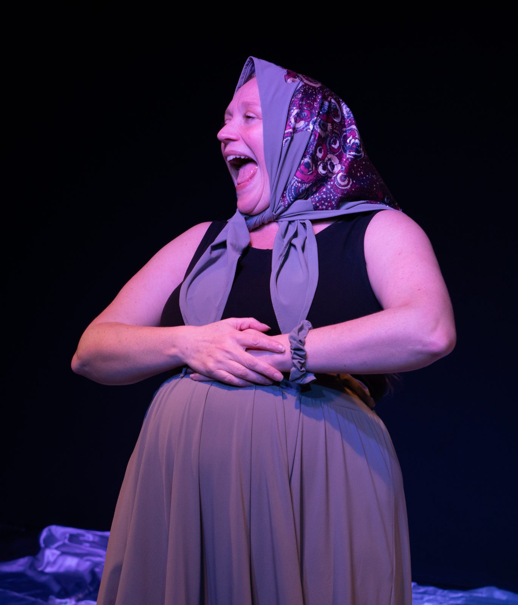
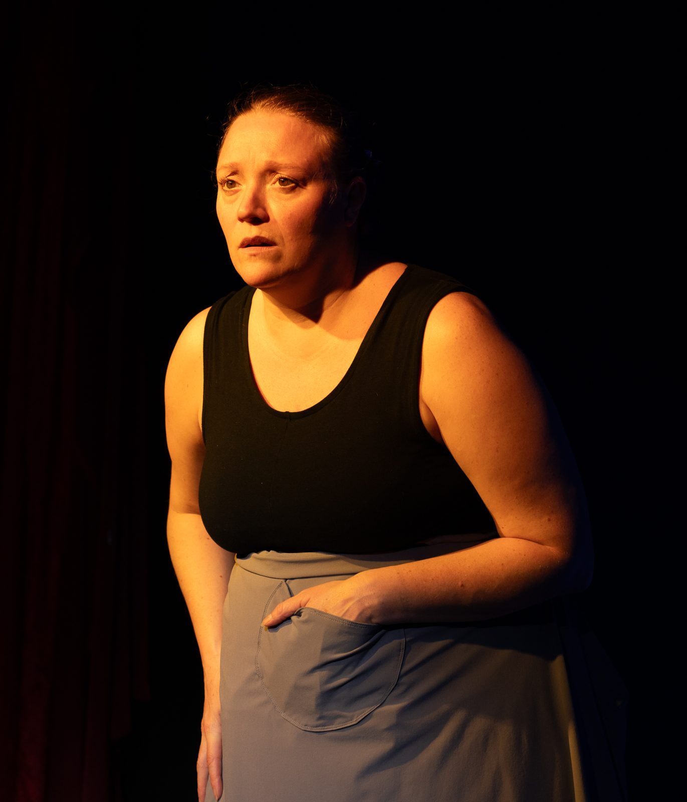

# Kate Mura: EPK & Archive

Static site. No build step, no dependencies. Just HTML, CSS, and images.

```
index.html                 EPK: The Play About My Father (the booking page)
archive.html               Archive: Suburban Tribe: Unmasked (2011-2015)
images/                    Photos and artwork
  pamf-2024/               <- drop new production photos here
press-kit/                 Downloadable PDF one-sheet
.nojekyll                  Tells GitHub Pages to serve files as-is
```

---

## Publishing it

1. Create a new repository on GitHub. Public, or private if you have a paid plan.
2. Upload everything in this folder to the repo (drag and drop works, use
   **Add file → Upload files** on the repo page).
3. Go to **Settings → Pages**.
4. Under "Source," pick **Deploy from a branch**. Branch: `main`, folder: `/ (root)`. Save.
5. Wait about a minute. The site goes live at:
   `https://YOUR-USERNAME.github.io/YOUR-REPO-NAME/`

### Custom domain (optional)

If Kate wants this at something like `theplayaboutmyfather.com`:

1. Buy the domain (Namecheap, Cloudflare, Google Domains, wherever).
2. In **Settings → Pages → Custom domain**, enter the domain and save.
   This creates a `CNAME` file in the repo.
3. At your domain registrar, add these DNS records:
   - Four `A` records pointing to `185.199.108.153`, `185.199.109.153`,
     `185.199.110.153`, `185.199.111.153`
   - Or, for a `www` subdomain, one `CNAME` record pointing to
     `YOUR-USERNAME.github.io`
4. Back in Settings → Pages, tick **Enforce HTTPS** once it becomes available.

DNS can take anywhere from a few minutes to a few hours to take effect.

---

## Making changes

Every edit can be done in the browser. Open the file on GitHub, click the
pencil icon, edit, then **Commit changes**. The live site updates in about a minute.

### Adding production photos

1. Put the image files in `images/pamf-2024/`.
2. In `index.html`, find the section marked `<!-- GALLERY -->`.
3. Replace the placeholder block with image tags:

```html
<div class="gallery">
  
  
</div>
```

Keep images under ~500KB each so pages stay fast. Always fill in the `alt`
text, since it's what screen readers announce, and it's where photo credit goes.

### Updating the PDF

The PDF in `press-kit/` is a separate file. Replacing it means generating a new
one and uploading it over the old one, keeping the same filename so existing
links don't break.

---

## Before this goes live: check these

- [ ] Booking email and phone number are current (both were carried over from
      a 2020 press kit and have not been verified)
- [ ] `katemura.com` still resolves
- [ ] Kate has approved the bio and press quotes
- [ ] Photo credits are correct on every image
- [ ] Real production photos have replaced the gallery placeholder

---

## A note on the two pages

`index.html` is the booking tool. It stays focused on the current show and
should be the link Kate sends to presenters.

`archive.html` is the history: Suburban Tribe: Unmasked, its full touring run,
and its original press. It exists so the past work is findable without
cluttering the pitch. When Kate makes a new show, the pattern holds: new show
becomes `index.html`, and The Play About My Father moves into the archive.
